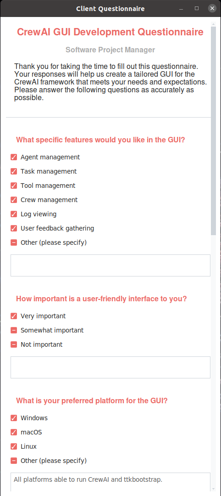
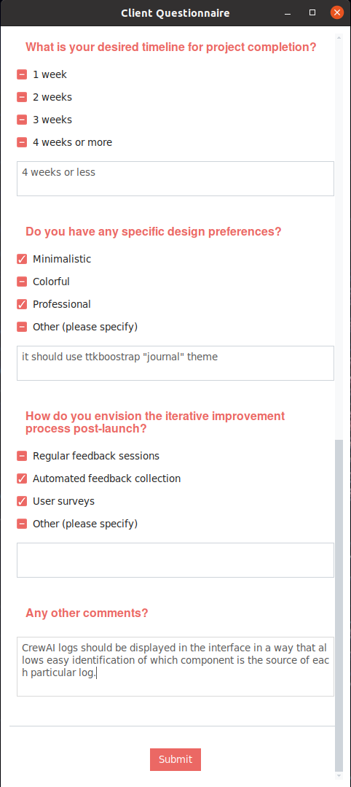
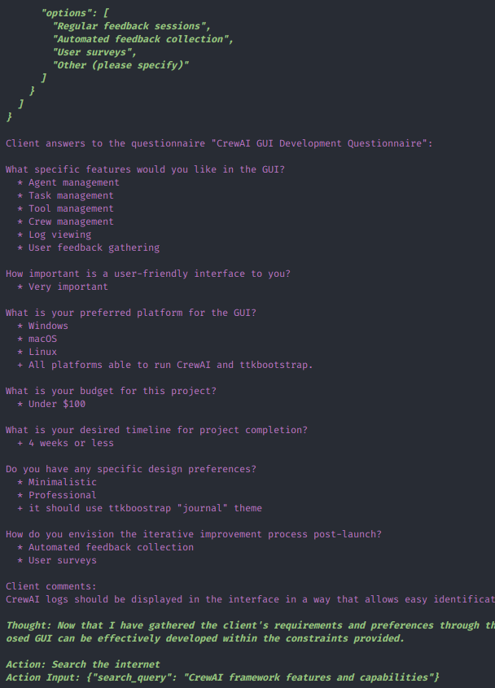

# Client Questionnaire Tool

This module provides a GUI tool for collecting answers from a human client based on provided questions and respective options in a questionnaire. It is designed to be used within the [CrewAI](https://www.crewai.com/) multi-agentic framework.

## Features

- **GUI Interface**: Easy-to-user graphical interface for clients to provide answers to LLM agent's questions.
- **Integration with CrewAI**: Seamless integration with the CrewAI framework for multi-agent collaboration.
- **Customizable Questions**: Ability to customize the questions and options in the questionnaire.
- **Comment Section**: A comment section for clients to provide additional information or feedback.

## Installation

To use the Client Questionnaire Tool within CrewAI framework, you need to have `ttkbootstrap` installed.
You can install it using pip:

```bash
pip install ttkbootstrap
```

Then, you can copy the `client_questionnaire_tool.py` file to the `tools` directory of your CrewAI project.

## Usage

To use the Client Questionnaire Tool within CrewAI framework, you can import the `ClientQuestionnaireTool` class in
`crew.py` file of the CrewAI app and add the tool's instance to the list of tools of relevant agents.

```python
from crewai import Agent, Crew, Process, Task
from crewai.project import CrewBase, agent, crew, task

# Import other tools as necessary

from .tools.client_questionnaire_tool import ClientQuestionnaireTool


@CrewBase
class MyQuestionnaireCrew:
    """My Questionnaire crew"""

    agents_config = "config/agents.yaml"
    tasks_config = "config/tasks.yaml"

    @agent
    def project_manager(self) -> Agent:
        return Agent(
            config=self.agents_config["project_manager"],
            tools=[
                ..., # Add other tools here as needed
                ClientQuestionnaireTool(), # Add the ClientQuestionnaireTool to the list of tools
            ],
            verbose=True,
        )

    @task
    def crewai_gui_software_project_proposal_task(self) -> Task:
        return Task(
            config=self.tasks_config["crewai_gui_software_project_proposal_task"],
            output_file="proposal.md",
        )

    @crew
    def crew(self) -> Crew:
        """Creates the Questionnaire crew"""
        return Crew(
            agents=self.agents,  # Automatically created by the @agent decorator
            tasks=self.tasks,  # Automatically created by the @task decorator
            process=Process.sequential,
            verbose=True,
            # process=Process.hierarchical, # In case you wanna use that instead https://docs.crewai.com/how-to/Hierarchical/
        )
```

## Example of the GUI and the Tool's Output

### GUI Screenshots





### Output Example



## Contributing

Contributions are welcome! Please open an issue or submit a pull request for any changes.

## License

This project is licensed under the MIT License. See the LICENSE file for details.
